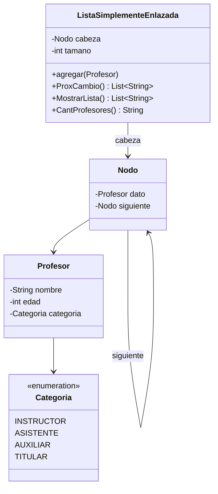

# Estructura-de-Datos-
Ejercicio de lista de profesores
# Control de Profesores con Lista Simplemente Enlazada

## 1. ¿Qué problema resolví?

En el departamento de Informática se necesita un sistema para controlar los datos de los profesores. De cada profesor guardo **nombre**, **edad** y **categoría docente** (Instructor, Asistente, Auxiliar o Titular). Para almacenarlos implementé mi propia **Lista Simplemente Enlazada** y le agregué tres métodos:

| Inciso | Método | Qué hace |
|--------|--------|----------|
| a) | `ProxCambio()` | Devuelve los nombres de los instructores con más de 26 años (próximos a pasar a Asistente) |
| b) | `MostrarLista()` | Devuelve la información de los profesores ordenada por edad, de mayor a menor |
| c) | `CantProfesores()` | Devuelve en un `String` la cantidad de profesores por categoría |

## 2. Estructura del proyecto

```
src/
├── Categoria.java                 (enum con las 4 categorías)
├── Profesor.java                  (nombre, edad, categoría)
├── Nodo.java                      (dato + referencia al siguiente)
├── ListaSimplementeEnlazada.java  (la lista y los 3 métodos)
└── Main.java                      (casos de prueba)
```

## 3. Diagrama de clases



Así se ve la lista en memoria:

```
cabeza → [Ana|25|Instructor] → [Luis|30|Instructor] → [María|45|Auxiliar] → null
```

## 4. Cómo lo hice

### Categoria, Profesor y Nodo
Para las categorías usé un **enum**, así evito errores de escritura que tendría con Strings sueltos. Creé la clase `Profesor` con sus tres atributos y su `toString()` para poder imprimirlo fácil. Después hice la clase `Nodo`, que guarda un `Profesor` y una referencia al siguiente nodo.

### ListaSimplementeEnlazada
Guardé la referencia a la `cabeza` y un contador `tamano`. Implementé el método `agregar()`, que recorre la lista hasta el último nodo y enlaza el nuevo ahí. Lo hice así para respetar el orden en que se insertan los profesores.

### a) ProxCambio()
Recorrí la lista nodo por nodo con un puntero `actual`. En cada nodo comprobé que la categoría fuera `INSTRUCTOR` **y** que la edad fuera **estrictamente mayor** que 26 (por eso una instructora de exactamente 26 años no aparece). Cada nombre que cumplió la condición lo guardé en una lista que devolví al final.

### b) MostrarLista()
Para no alterar el orden de mi lista original, recorrí los nodos y fui insertando cada profesor en una lista auxiliar en la posición correcta (**inserción ordenada**): avanzo mientras los que ya están tengan edad mayor o igual a la del nuevo. Con esto obtuve el orden de mayor a menor y, además, cuando dos profesores tienen la misma edad, conservo el orden en que los inserté. Al final convertí cada profesor a texto y devolví el listado.

### c) CantProfesores()
Declaré un contador por categoría, recorrí la lista y, con un `switch` sobre la categoría de cada profesor, incrementé el contador que correspondía. Al terminar armé y devolví un `String` con una línea por categoría.

## 5. Casos de prueba

Los hice en `Main.java` y cubrí tres situaciones:

1. **Lista con datos variados**: incluí un instructor de 25 años (no entra), uno de 26 (el límite, tampoco entra), instructores de 27 y 30 (sí entran) y dos profesores con la misma edad (45) para comprobar el desempate.
2. **Lista vacía**: comprobé que mis tres métodos no fallen y devuelvan resultados vacíos o con ceros.
3. **Nadie próximo a cambio**: probé con un instructor menor de 26 y un titular, y verifiqué que `ProxCambio()` devuelva una lista vacía.

En `ProxCambio()` comparé el resultado contra el valor esperado y el programa imprime `OK` o `FALLO`.

### Salida del caso 1

```
-- ProxCambio() --
[Luis Gómez, Elena Torres]
Esperado: [Luis Gómez, Elena Torres] -> OK

-- MostrarLista() (edad de mayor a menor) --
Carlos Ruiz | Edad: 58 | Categoría: Titular
María Díaz | Edad: 45 | Categoría: Auxiliar
Pedro Lara | Edad: 45 | Categoría: Asistente
Jorge Núñez | Edad: 33 | Categoría: Asistente
Luis Gómez | Edad: 30 | Categoría: Instructor
Elena Torres | Edad: 27 | Categoría: Instructor
Sofía Vega | Edad: 26 | Categoría: Instructor
Ana Pérez | Edad: 25 | Categoría: Instructor

-- CantProfesores() --
Instructor: 4
Asistente: 2
Auxiliar: 1
Titular: 1
```

## 6. Cómo ejecutarlo

```bash
cd src
javac -encoding UTF-8 *.java
java Main
```

## 7. Complejidad

- `agregar()`: recorro toda la lista para insertar al final, así que es **O(n)**.
- `ProxCambio()` y `CantProfesores()`: hago un solo recorrido, **O(n)**.
- `MostrarLista()`: hago una inserción ordenada por cada elemento, **O(n²)** en el peor caso.
